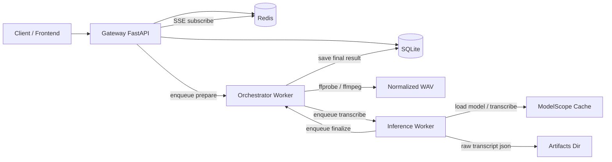
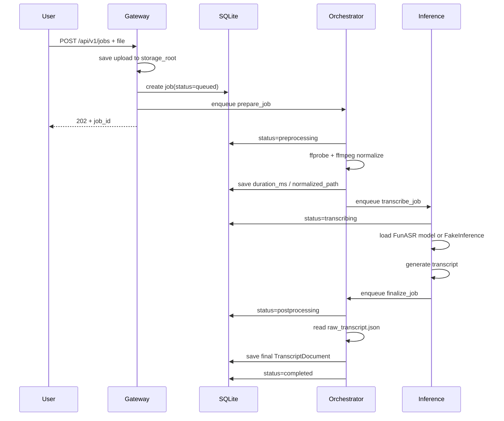
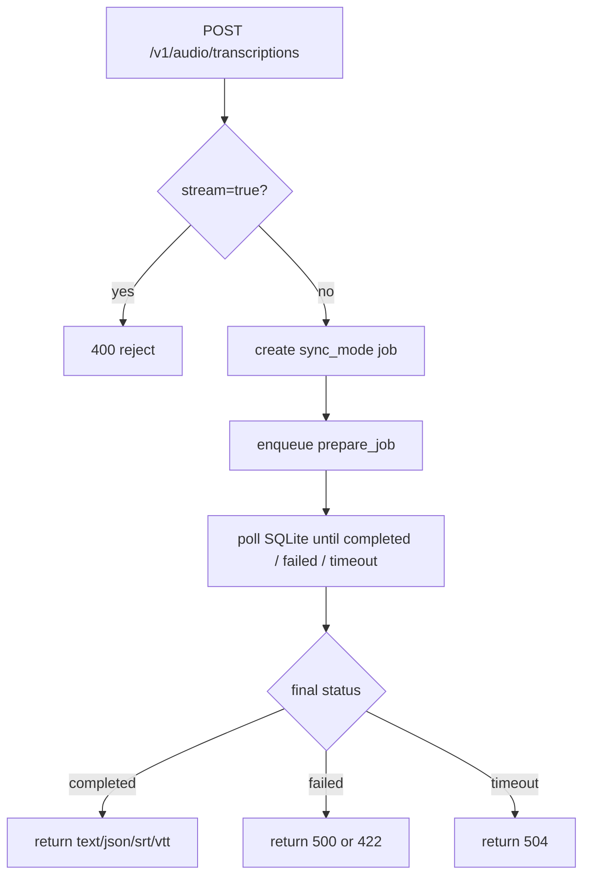

# Claude Handoff

这份文档是给后续维护这个仓库的 Claude / Codex / 人类工程师看的快速交接说明。目标不是重复 README，而是把“代码怎么组织、请求怎么流转、从哪里开始改、哪些坑已经踩过”说清楚。

## 1. 项目定位

当前仓库是一个“飞书妙记式”后端骨架，先做稳这些能力：
- 上传音频/视频
- 创建异步转写任务
- `ffmpeg` 归一化音频
- 走 `FSMN-VAD -> ASR -> Punc -> Speaker` 主链路
- 落结构化 transcript
- 导出 `txt / srt / vtt / json`

当前没有做的事：
- 真正的 realtime WebSocket / WebRTC 转写
- 多租户 / SaaS 能力
- 完整 overlap-aware diarization
- 生产级对象存储和分布式调度

## 1.1 技术栈速查

这部分是给接手的人快速建立“项目实际用了哪些技术”的索引。

### API / Web

- `FastAPI`
  - 对外 HTTP API
  - 业务接口和 OpenAI-compatible 适配层都基于它
- `SSE`
  - job 进度推送
  - 当前还没有做 realtime WebSocket 转写
- `Pydantic v2`
  - schema、配置、领域对象

### 数据 / 任务

- `SQLite`
  - 当前单机版本的主数据库
- `SQLAlchemy 2.x`
  - ORM、Session、Engine
- `Alembic`
  - 数据库迁移
- `Redis`
  - 队列 broker 和事件通道
- `Dramatiq`
  - 异步任务执行框架
  - 当前项目不是 `Celery`

### 媒体 / 推理

- `ffmpeg` / `ffprobe`
  - 音频探测、抽取、转码、重采样
- `FunASR`
  - ASR / VAD / Punc / Speaker 的主要推理入口
- `ModelScope`
  - 模型缓存和本地模型来源
- `PyTorch`
  - 推理运行时底座

### 工程化 / 部署

- `Docker Compose`
  - 单机容器编排
- `Loguru`
  - 结构化日志
- `pytest`
  - smoke / unit tests

## 2. 代码结构

### 顶层目录

```text
.
├── README.md
├── docker-compose.yml
├── alembic.ini
├── alembic/
├── docs/
├── scripts/
├── src/
│   ├── minutes_core/
│   ├── minutes_gateway/
│   ├── minutes_orchestrator/
│   └── minutes_inference/
└── tests/
    ├── core/
    ├── gateway/
    └── orchestrator/
```

### 关键模块分工

- [`src/minutes_core`](/home/ysnow/workspaces/app/minutes/src/minutes_core)
  - 放共享 domain、配置、SQLite、导出、日志、事件、队列协议
  - 如果要改数据结构、配置项、数据库、导出格式，大概率从这里下手
- [`src/minutes_gateway`](/home/ysnow/workspaces/app/minutes/src/minutes_gateway)
  - FastAPI 网关
  - 对外 HTTP API、OpenAI-compatible 适配层、依赖注入都在这里
- [`src/minutes_orchestrator`](/home/ysnow/workspaces/app/minutes/src/minutes_orchestrator)
  - CPU 侧任务编排
  - 负责媒体探测、转码、状态推进、最终聚合
- [`src/minutes_inference`](/home/ysnow/workspaces/app/minutes/src/minutes_inference)
  - 推理层
  - 负责模型池、FakeInference、FunASR 引擎、转写任务
- [`tests`](/home/ysnow/workspaces/app/minutes/tests)
  - `core`：repository/export
  - `gateway`：HTTP API
  - `orchestrator`：prepare/transcribe/finalize 异步链路 smoke

## 3. 关键文件入口

- 配置：[`config.py`](/home/ysnow/workspaces/app/minutes/src/minutes_core/config.py)
- 领域类型：[`schemas.py`](/home/ysnow/workspaces/app/minutes/src/minutes_core/schemas.py)
- SQLite / Session：[`db.py`](/home/ysnow/workspaces/app/minutes/src/minutes_core/db.py)
- JobRepository：[`repositories.py`](/home/ysnow/workspaces/app/minutes/src/minutes_core/repositories.py)
- 导出器：[`export.py`](/home/ysnow/workspaces/app/minutes/src/minutes_core/export.py)
- 网关 App：[`app.py`](/home/ysnow/workspaces/app/minutes/src/minutes_gateway/app.py)
- 业务 API：[`jobs.py`](/home/ysnow/workspaces/app/minutes/src/minutes_gateway/routers/jobs.py)
- OpenAI-compatible：[`openai.py`](/home/ysnow/workspaces/app/minutes/src/minutes_gateway/routers/openai.py)
- 编排服务：[`services.py`](/home/ysnow/workspaces/app/minutes/src/minutes_orchestrator/services.py)
- 推理服务：[`service.py`](/home/ysnow/workspaces/app/minutes/src/minutes_inference/service.py)
- FunASR 引擎：[`funasr_engine.py`](/home/ysnow/workspaces/app/minutes/src/minutes_inference/engines/funasr_engine.py)
- 本地顺序执行脚本：[`local_run_job.py`](/home/ysnow/workspaces/app/minutes/scripts/local_run_job.py)

## 3.1 技术栈和代码的映射关系

如果 Claude 想从“技术名词”快速跳回代码入口，可以按这个索引看：

- `FastAPI`
  - [`src/minutes_gateway/app.py`](/home/ysnow/workspaces/app/minutes/src/minutes_gateway/app.py)
  - [`src/minutes_gateway/routers/jobs.py`](/home/ysnow/workspaces/app/minutes/src/minutes_gateway/routers/jobs.py)
  - [`src/minutes_gateway/routers/openai.py`](/home/ysnow/workspaces/app/minutes/src/minutes_gateway/routers/openai.py)
- `Redis + Dramatiq`
  - [`src/minutes_core/queue.py`](/home/ysnow/workspaces/app/minutes/src/minutes_core/queue.py)
  - [`src/minutes_orchestrator/actors.py`](/home/ysnow/workspaces/app/minutes/src/minutes_orchestrator/actors.py)
  - [`src/minutes_inference/actors.py`](/home/ysnow/workspaces/app/minutes/src/minutes_inference/actors.py)
- `SQLite + SQLAlchemy + Alembic`
  - [`src/minutes_core/db.py`](/home/ysnow/workspaces/app/minutes/src/minutes_core/db.py)
  - [`src/minutes_core/models.py`](/home/ysnow/workspaces/app/minutes/src/minutes_core/models.py)
  - [`src/minutes_core/repositories.py`](/home/ysnow/workspaces/app/minutes/src/minutes_core/repositories.py)
  - [`alembic/env.py`](/home/ysnow/workspaces/app/minutes/alembic/env.py)
- `ffmpeg / ffprobe`
  - [`src/minutes_core/media.py`](/home/ysnow/workspaces/app/minutes/src/minutes_core/media.py)
  - [`src/minutes_orchestrator/services.py`](/home/ysnow/workspaces/app/minutes/src/minutes_orchestrator/services.py)
- `FunASR / ModelScope / PyTorch`
  - [`src/minutes_inference/engines/funasr_engine.py`](/home/ysnow/workspaces/app/minutes/src/minutes_inference/engines/funasr_engine.py)
  - [`src/minutes_inference/service.py`](/home/ysnow/workspaces/app/minutes/src/minutes_inference/service.py)
- `Loguru`
  - [`src/minutes_core/logging.py`](/home/ysnow/workspaces/app/minutes/src/minutes_core/logging.py)

## 4. 运行时组件图



## 5. 异步任务主流程

这是最核心的一条链路。



## 6. 同步 OpenAI-compatible 流程

这个接口是薄适配层，不是主业务模型。



## 7. 本地调试推荐流程

### 最省事路径

1. 跑测试

```bash
pytest -q
```

2. 跑迁移

```bash
python3 -m alembic upgrade head
```

3. 用 fake inference 跑一条真实音频

```bash
python3 scripts/local_run_job.py --fake-inference /path/to/audio.m4a
```

4. 再切真实模型

```bash
python3 scripts/local_run_job.py --device cpu /path/to/audio.m4a
```

### 为什么推荐先走 `--fake-inference`

- 可以先验证 `SQLite + ffmpeg + repository + finalize` 这条主干
- 一旦失败，问题范围更小
- 避免把“业务代码 bug”和“模型环境问题”混在一起

## 8. 当前模型策略

### Profile

- `cn_meeting`
  - `Paraformer-large + FSMN-VAD + CT-Punc + CAM++`
  - 优先中文会议场景
- `multilingual_rich`
  - `SenseVoiceSmall + FSMN-VAD`
  - 面向多语言与 richer tags

### 一个明确的设计约束

不要把 `SenseVoice` 和 `Paraformer` 串在同一条生产链路里。

原因：
- 能力重叠
- 显存占用会明显变重
- 运维和调参复杂度会飙升
- 当前 profile 二选一已经足够表达需求

## 9. 已经踩过的坑

### 1. `JobDetail` 不能只放“对外展示字段”

真实本地 smoke 跑出来过一次 bug：
- `JobDetail` 里没有 `source_path` / `output_dir`
- 结果 orchestrator / inference 内部拿不到源文件路径

所以现在 [`JobDetail`](/home/ysnow/workspaces/app/minutes/src/minutes_core/schemas.py) 既承担 API 返回的一部分，也承担内部任务链路的数据传递。这个设计不算完美，但当前版本是实用且已验证的。

### 2. `local_run_job.py` 不能在推理失败后继续 finalize

之前真实模型失败时，脚本还会继续执行 finalize，然后因为 `raw_transcript.json` 不存在而报第二个错。现在已经修成：
- inference 后先查 job 状态
- 如果已经 `failed`，直接退出并打印错误

### 3. 当前机器的 GPU 栈有问题，不是项目代码问题

已经实际验证过：
- 最基础的 `torch` CUDA 矩阵乘都会报 `CUBLAS_STATUS_NOT_INITIALIZED`
- 所以 `FunASR + cuda:0` 当前一定会失败

这意味着：
- 项目代码层真实模型链路已经通
- 但当前机器上想跑 GPU，需要先修 PyTorch/CUDA 运行时

### 4. 真实模型已用 CPU 跑通

已经用同一份会议录音切 30 秒样本，实际跑通：

```bash
python3 scripts/local_run_job.py --device cpu '.local-run/sample-30s.wav'
```

并成功产出中文 transcript。

## 10. 维护时的优先切入点

### 如果要继续补功能

推荐顺序：
1. 修 GPU 运行时
2. 跑完整真实模型本地链路
3. 给 `events/export/auth` 补更多 gateway tests
4. 把 OpenAI-compatible 接口和业务 API 的边界再收清楚
5. 再考虑 realtime 或更强 diarization

### 如果要重构

优先考虑这些点：
- 把 `JobDetail` 的“内部字段”和“对外字段”拆成更清晰的类型
- 给 `EventBus` 增加更明确的 fake / memory 实现，减少测试 monkeypatch
- 为 `FunASREngine` 增加更细粒度的错误分类
- 把 `README` 里的验证结果数字和真实现状保持同步

## 11. 当前验证状态

截至这份文档落地时，已验证：
- `pytest -q` -> `17 passed`
- `python3 -m alembic upgrade head` -> 可执行
- `docker compose config` -> 可解析
- `python3 scripts/local_run_job.py --fake-inference ...` -> 可完成整条顺序链路
- `python3 scripts/local_run_job.py --device cpu ...` -> 真实模型可出字

未完成验证：
- 当前机器上的 GPU 真实模型端到端链路
- 容器内真实模型端到端链路
